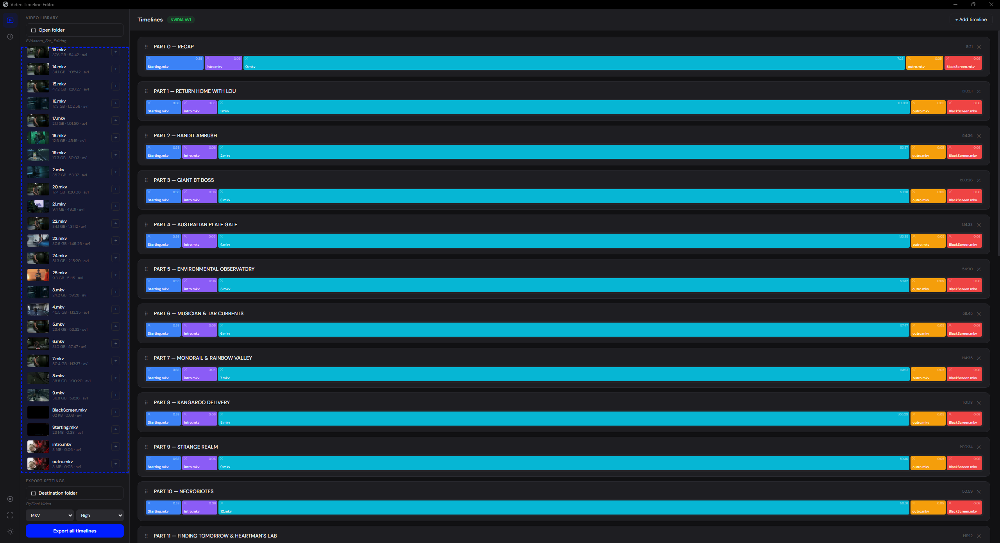
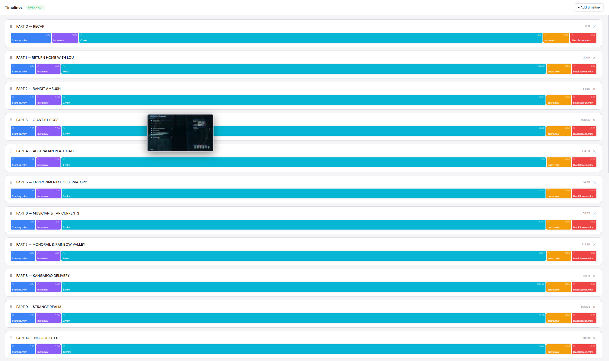
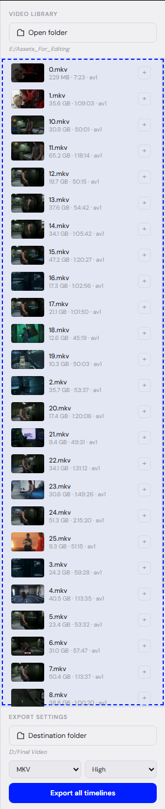
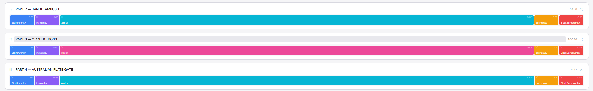
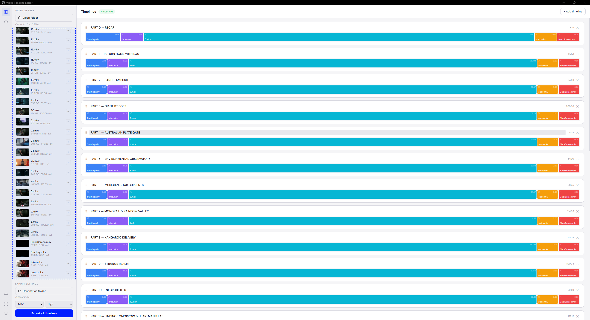
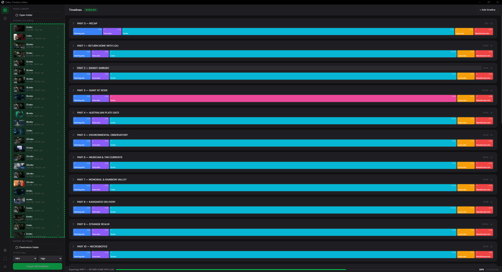
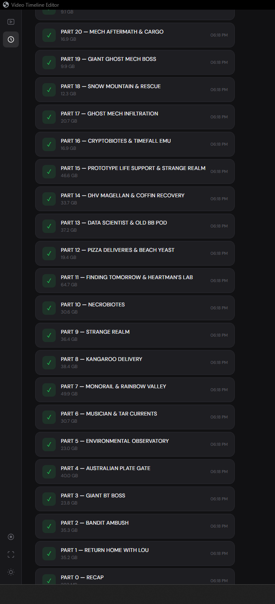

# 🎬 Video Timeline Editor

A desktop application for creating multiple video timelines and exporting them with GPU-accelerated encoding. Built with Python + Eel for a native-feeling experience with a modern web UI.


---

<!-- SCREENSHOT: Main editor view with dark theme, video library on left, timelines on right -->
<!-- Replace with your screenshot: -->


---

## ✨ Features

### 🎞️ Multi-Timeline Editor
Create unlimited named timelines, drag videos between them, and reorder clips with drag-and-drop. Each clip is proportionally sized by duration so you can see the shape of your edit at a glance.

<!-- SCREENSHOT: Multiple timelines with clips of different sizes and colors -->


### 🚀 GPU-Accelerated Export
Auto-detects the best available encoder on your system. Supports NVIDIA NVENC (AV1 & H.264), Intel QuickSync, AMD AMF, Apple VideoToolbox, with automatic CPU fallback.

| Priority | Encoder | Hardware |
|----------|---------|----------|
| 1 | `av1_nvenc` | NVIDIA RTX 4000+ |
| 2 | `av1_qsv` | Intel Arc / 12th Gen+ |
| 3 | `av1_amf` | AMD RX 7000+ |
| 4 | `libaom-av1` | CPU (any) |
| 5 | `h264_nvenc` | NVIDIA GTX 600+ |
| 6 | `h264_amf` | AMD GCN+ |
| 7 | `libx264` | CPU fallback |

### ⚡ Lossless Concatenation
When all clips share the same codec and resolution, the app uses FFmpeg stream copy (`-c copy`) — **zero quality loss, zero re-encoding**. A 50GB timeline exports in seconds. Re-encoding only happens when clips have different codecs or resolutions.

### 🖼️ Video Thumbnails
Every video gets a thumbnail preview extracted automatically when you load a folder. Thumbnails are cached so subsequent loads are instant.

<!-- SCREENSHOT: Video library sidebar showing thumbnails, file sizes, durations, codecs -->


### 🎨 Clip Color Coding
Double-click any clip on a timeline to cycle through 8 colors. Organize your edit visually — mark intros, B-roll, interviews, outros with distinct colors.

<!-- SCREENSHOT: Timeline with color-coded clips -->


### 🔍 Tooltip Previews
Hover over any video in the library or any clip on a timeline to see a larger thumbnail preview following your cursor.

### 📏 Resizable Sidebar
Drag the edge of the sidebar to make it wider or narrower. Fits your workflow whether you have 5 videos or 500.

### 🌙 Dark & Light Theme
Toggle between dark and light mode. Your preference is saved automatically.

<!-- SCREENSHOT: Side-by-side comparison of dark and light theme -->


### 🎨 Custom Accent Color
Click the color circle in the navigation rail to pick any accent color. Changes buttons, badges, progress bars, and highlights across the entire UI.

<!-- SCREENSHOT: App with a custom accent color (e.g. orange or green) -->


### 📊 Export History
Every export is logged with status (success/failure), file size, and timestamp. Review past exports from the History page.

<!-- SCREENSHOT: Export history page showing completed exports -->


### 📋 Export Options
Choose your output format (MKV, MP4, WebM) and quality preset (High, Medium, Fast) before exporting. Live progress bar with wall-clock ETA.

### 🔔 Export Notifications
A notification sound plays when export completes so you can work on other things while waiting.

### 🖥️ Fullscreen Mode
Press F11 or click the fullscreen button for a distraction-free editing experience.

### ⚡ Parallel Processing
Video metadata and thumbnails are extracted in parallel (4 threads) so loading large folders is fast and doesn't freeze the UI.

---

## 📸 Screenshots

> **Note:** Replace the placeholder paths below with your actual screenshots.
> Save them in a `screenshots/` folder next to the README.

| View | Screenshot |
|------|-----------|
| Main Editor (Dark) | `screenshots/main-editor-dark.png` |
| Main Editor (Light) | `screenshots/main-editor-light.png` |
| Video Library with Thumbnails | `screenshots/video-library.png` |
| Timelines with Clips | `screenshots/timelines.png` |
| Color-Coded Clips | `screenshots/color-coding.png` |
| Export in Progress | `screenshots/export-progress.png` |
| Export History | `screenshots/export-history.png` |
| Custom Accent Color | `screenshots/accent-color.png` |
| Tooltip Preview | `screenshots/tooltip-preview.png` |

**How to take screenshots:**
1. Run the app
2. Press `Win + Shift + S` (Windows) to open Snipping Tool
3. Select the area and save to `screenshots/` folder
4. Update the image paths in this README

---

## 🛠️ Installation

### Prerequisites

- **Python 3.10+** — [Download](https://www.python.org/downloads/)
- **FFmpeg** — Must be in system PATH
- **Google Chrome** — Used as the app window

### Step 1: Install FFmpeg

**Windows:**
```bash
winget install Gyan.FFmpeg
```

**macOS:**
```bash
brew install ffmpeg
```

**Linux:**
```bash
sudo apt install ffmpeg
```

Verify it works:
```bash
ffmpeg -version
```

### Step 2: Install Python dependency

```bash
pip install eel
```

### Step 3: Run the app

```bash
cd VideoTimelineEditor
python main.py
```

The app opens in a Chrome window. If Chrome isn't found, it falls back to your default browser.

---

## 🎯 Usage

### Quick Start

1. **Open a folder** — Click "Open folder" in the sidebar and select a folder with video files
2. **Wait for loading** — The app probes each file for duration, codec, resolution, and extracts thumbnails (progress bar shows status)
3. **Create timelines** — Click "+ Add timeline" to create named timelines
4. **Add videos** — Drag videos from the library onto timelines, or click the `+` button to add a video to all timelines at once
5. **Arrange clips** — Drag clips within a timeline to reorder, or between timelines to move them
6. **Set destination** — Click "Destination folder" and pick where to save
7. **Choose format** — Select MKV/MP4/WebM and High/Medium/Fast quality
8. **Export** — Click "Export all timelines" and watch the progress bar

### Keyboard Shortcuts

| Key | Action |
|-----|--------|
| `F11` | Toggle fullscreen |
| `Alt + 1` | Switch to Editor page |
| `Alt + 2` | Switch to History page |

### Drag & Drop

| Action | How |
|--------|-----|
| Add video to timeline | Drag from library → drop on timeline |
| Add video at specific position | Drag from library → drop on a clip |
| Move clip between timelines | Drag clip → drop on another timeline |
| Reorder clip within timeline | Drag clip → drop on another clip in same timeline |
| Change clip color | Double-click a clip |

### Supported Video Formats

`.mp4` `.mov` `.mkv` `.avi` `.flv` `.webm` `.ts` `.m4v`

---

## 🏗️ Project Structure

```
VideoTimelineEditor/
├── main.py              # Python backend (Eel server, FFmpeg, GPU detection)
├── README.md            # This file
├── screenshots/         # Your screenshots go here
│   ├── main-editor-dark.png
│   ├── main-editor-light.png
│   ├── video-library.png
│   ├── timelines.png
│   ├── color-coding.png
│   ├── export-progress.png
│   ├── export-history.png
│   ├── accent-color.png
│   └── tooltip-preview.png
└── web/
    ├── index.html       # App layout and structure
    ├── app.js           # Frontend logic (state, drag-drop, UI)
    └── styles.css       # Styling with dark/light theme
```

### Architecture

```
┌─────────────────────────────────────────────┐
│                  Frontend                    │
│  index.html + app.js + styles.css           │
│  (Runs in Chrome via Eel)                   │
│                                             │
│  • Drag-and-drop timeline editor            │
│  • Theme / accent color / fullscreen        │
│  • Tooltip previews                         │
│  • Export progress display                  │
└──────────────┬──────────────────────────────┘
               │ Eel (WebSocket)
┌──────────────▼──────────────────────────────┐
│                  Backend                     │
│  main.py (Python)                           │
│                                             │
│  • Folder scanning + parallel probing       │
│  • Thumbnail extraction (4 threads)         │
│  • GPU encoder auto-detection               │
│  • FFmpeg export with progress streaming    │
│  • Lossless concat / GPU re-encode          │
└──────────────┬──────────────────────────────┘
               │ subprocess
┌──────────────▼──────────────────────────────┐
│              FFmpeg / FFprobe                │
│                                             │
│  • Video probing (duration, codec, res)     │
│  • Thumbnail extraction                     │
│  • Stream copy (lossless concat)            │
│  • GPU-accelerated re-encoding              │
└─────────────────────────────────────────────┘
```

---

## ⚙️ Configuration

### Changing Window Size

In `main.py`, edit the last line:
```python
eel.start("index.html", size=(1400, 900), ...)
```

### Changing Browser

```python
# Use default browser instead of Chrome
eel.start("index.html", mode=None, ...)

# Use Edge
eel.start("index.html", mode="edge", ...)
```

### Adding Video Formats

In `main.py`, edit the `VIDEO_EXT` tuple:
```python
VIDEO_EXT = (".mp4", ".mov", ".mkv", ".avi", ".flv", ".webm", ".ts", ".m4v")
```

### Thumbnail Cache

Thumbnails are cached in:
- **Windows:** `C:\Users\<you>\.videotimeline\thumbs\`
- **macOS/Linux:** `~/.videotimeline/thumbs/`

Delete this folder to regenerate all thumbnails.

---

## 🔧 Troubleshooting

| Problem | Solution |
|---------|----------|
| "Chrome not found" | Install Chrome, or change `mode="chrome"` to `mode=None` in `main.py` |
| FFmpeg not found | Run `ffmpeg -version` to verify. Install with `winget install Gyan.FFmpeg` |
| No GPU acceleration | Your GPU drivers may be outdated. Update them. The app falls back to CPU automatically |
| Thumbnails not loading | Check that FFmpeg is working. Delete `~/.videotimeline/thumbs/` and reload |
| Export fails | Check the terminal/console for FFmpeg error messages |
| App won't start | Make sure `eel` is installed: `pip install eel` |
| Tkinter errors (Linux) | Install: `sudo apt install python3-tk` |
| Videos not showing in folder | Check that the files have a supported extension (see list above) |
| Slow folder loading | Large folders with many videos take time to probe. The progress bar shows status |

---

## 📦 Building an Executable

To distribute the app as a standalone `.exe`:

```bash
pip install pyinstaller

pyinstaller --onefile --noconsole --add-data "web;web" --name VideoTimelineEditor main.py
```

The output will be in `dist/VideoTimelineEditor.exe`. Users still need FFmpeg installed on their system.

For a fully portable build with FFmpeg bundled:
```bash
pyinstaller --onefile --noconsole --add-data "web;web" --add-binary "path/to/ffmpeg.exe;." --add-binary "path/to/ffprobe.exe;." --name VideoTimelineEditor main.py
```

---

## 🤝 Contributing

1. Fork the repo
2. Create a feature branch (`git checkout -b feature/my-feature`)
3. Commit your changes (`git commit -m 'Add my feature'`)
4. Push to the branch (`git push origin feature/my-feature`)
5. Open a Pull Request

---

## 📄 License

MIT License — free for personal and commercial use.

---

## 🙏 Acknowledgments

- [Eel](https://github.com/python-eel/Eel) — Python library for desktop apps with web UI
- [FFmpeg](https://ffmpeg.org/) — The multimedia processing powerhouse
- [DM Sans](https://fonts.google.com/specimen/DM+Sans) — Typography by Colophon Foundry
